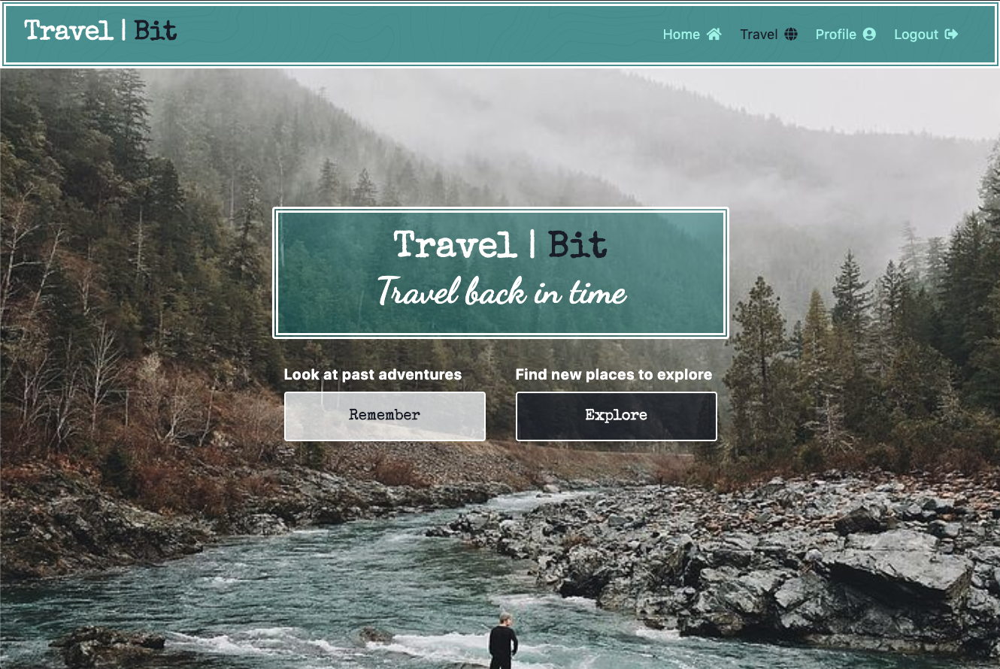

# TravelBIT
https://travel-bit.herokuapp.com/

TravelBit - Save Your Travels One Bit at a Time

TravelBit is a web application that allows users to save their countries, states, cities and trips that they have experienced so that they can look back on old trips and share with friends and family.

## Site Image


## Table of Contents

- [Technologies Used](#Technologies-Used)
- [Installation](#Installation)
- [Code Snippets](#Code-Snippets)
- [Usage](#Usage)
- [Acknowledgements](#Acknoledgements)
- [Authors](#Authors)

## Technologies Used
- Sequelize
- MySQL
- React
- Tailwind css
- Firebase authentication
- Express
- Nodejs
- Axios
- Heroku
- Javascript
- Pixabay API

## Installation

To install necessary dependencies, run the following command:
```
npm install
```

## Code Snippets
```

```

## Usage
Click the [TravelBit](https://travel-bit.herokuapp.com/
) link to go to the website or download and run 
``` 
npm start
```
Signup, Login, and Complete your Profile.
Click on the Travel link in the menu to view your countries. Click Add Country to add country details. Click on a country to see states/cities for a particular country. And click on a city to view trips.


The Following GIF will demonstrate how to edit an existing application.


## Author
   

Nadine Bundschuh

[GitHub](https://github.com/nadineb1160) 